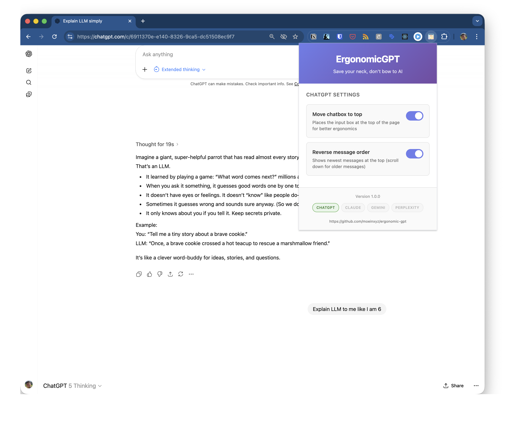

# ErgonomicGPT Chrome Extension

**Save your neck, don't bow to AI**

A Chrome extension that reverses AI chat interfaces to prevent neck strain by moving the chat input to the top and optionally reversing message order.

## Preview



## Problem

When using AI chat interfaces like ChatGPT, the chat input box is at the bottom of the page. As new messages appear, you constantly lean forward and look down to read them, causing neck strain and poor posture during extended usage.

## Solution

ErgonomicGPT provides two configurable features:

### Feature 1: Move Chatbox to Top ✅
- Places the chat input at the **TOP** of the page
- No more scrolling to type your next message
- Reduces neck strain from looking down

### Feature 2: Reverse Message Order ✅
- Newest messages appear at the **TOP**
- Scroll **DOWN** to read older messages
- Natural reading position - like reading a book

Both features are **independently toggleable** via the extension popup!

## Installation

### Option 1: Load Unpacked (Development/Testing)

1. Clone or download this repository
2. Open Chrome and navigate to `chrome://extensions/`
3. Enable **"Developer mode"** (toggle in top right)
4. Click **"Load unpacked"**
5. Select the `ergonomicGPT` folder
6. Extension installed! 🎉

### Option 2: From Chrome Web Store (Coming Soon)

Once published, you'll be able to install directly from the Chrome Web Store.

## Usage

### Basic Usage

1. Install the extension
2. Navigate to [ChatGPT](https://chatgpt.com)
3. The layout automatically reverses (both features enabled by default)
4. Start chatting with proper ergonomic posture!

### Configuring Settings

1. Click the **ErgonomicGPT** extension icon in your browser toolbar
2. Toggle features on/off:
   - **Move chatbox to top** - Places input at the top
   - **Reverse message order** - Shows newest messages first
3. Settings save automatically and apply immediately!

## Supported Platforms

### Phase 1 (Current) ✅
- **ChatGPT** ([chatgpt.com](https://chatgpt.com), [chat.openai.com](https://chat.openai.com))
  - Fully functional with configurable settings
  - Automated tests with 100% coverage
  - Works with dark mode

### Phase 2 (Future) 🚧
- **Claude** ([claude.ai](https://claude.ai))
- **Gemini** ([gemini.google.com](https://gemini.google.com))
- **Perplexity** ([perplexity.ai](https://perplexity.ai))

## Features

- ✅ **Configurable chatbox position** - Toggle on/off via popup
- ✅ **Independent message reversal** - Works separately or together
- ✅ **Persistent settings** - Syncs across devices via Chrome storage
- ✅ **Real-time updates** - No page reload needed
- ✅ **Dark mode support** - Works seamlessly with ChatGPT's dark theme
- ✅ **Fully tested** - Comprehensive automated test suite
- ✅ **Performance optimized** - Pure CSS-based solution
- ✅ **Clean UI** - Modern, intuitive popup interface

## How It Works

The extension uses a pure CSS approach for maximum performance:

1. **Content Script** (`chatgpt.js`):
   - Loads user settings from `chrome.storage.sync`
   - Applies CSS classes to `<html>` element
   - Listens for settings changes

2. **CSS Styles** (`chatgpt.css`):
   - Uses `flex-direction: column-reverse` to flip layouts
   - Targets specific ChatGPT DOM elements
   - Maintains proper overflow and spacing

3. **Popup UI** (`popup/`):
   - Simple toggle switches for each feature
   - Saves settings to Chrome sync storage
   - Real-time status updates

## Development

### File Structure
```
ergonomicGPT/
├── manifest.json              # Extension configuration
├── icons/                     # Extension icons (16px, 48px, 128px)
├── content-scripts/           # Site-specific injection scripts
│   ├── chatgpt.js            # ChatGPT content script
│   ├── claude.js             # Claude (Phase 2)
│   ├── gemini.js             # Gemini (Phase 2)
│   └── perplexity.js         # Perplexity (Phase 2)
├── styles/                    # Site-specific CSS
│   ├── chatgpt.css           # ChatGPT layout reversal styles
│   └── ...
├── popup/                     # Extension popup UI
│   ├── popup.html            # Settings interface
│   ├── popup.css             # Popup styling
│   └── popup.js              # Settings logic
├── tests/                     # Automated test suite
│   ├── functional/           # DOM and settings tests
│   ├── visual/               # Screenshot regression tests
│   ├── interactive/          # User interaction tests
│   ├── utils/                # Test utilities
│   └── README.md             # Testing documentation
└── Examples/                  # Test fixtures and examples
```

### Testing

The extension includes a comprehensive automated test suite. See [tests/README.md](tests/README.md) for details.

#### Quick Start

```bash
cd tests
npm install
npm run baseline:create  # Create baseline screenshots
npm test                 # Run all tests
```

#### Test Coverage

- ✅ **Functional Tests** - DOM structure and CSS application
- ✅ **Visual Regression Tests** - Screenshot comparison
- ✅ **Interactive Tests** - Scrolling, typing, navigation
- ✅ **Settings Persistence Tests** - Storage and sync
- ✅ **Cross-browser Tests** - Chrome, Edge, Brave

### Making Changes

1. **Modify CSS** - Edit `styles/chatgpt.css`
2. **Update Logic** - Edit `content-scripts/chatgpt.js`
3. **Test Locally**:
   ```bash
   # Reload extension in chrome://extensions/
   # Refresh ChatGPT page
   # Verify changes work correctly
   ```
4. **Run Tests**:
   ```bash
   cd tests
   npm test
   ```
5. **Update Baselines** (if visuals changed intentionally):
   ```bash
   npm run baseline:create
   ```

### Building Icons

Generate PNG icons from SVG source:

```bash
# Using ImageMagick
brew install imagemagick
convert -background none icons/icon.svg -resize 16x16 icons/icon16.png
convert -background none icons/icon.svg -resize 48x48 icons/icon48.png
convert -background none icons/icon.svg -resize 128x128 icons/icon128.png
```

Or use an online SVG to PNG converter.

## Contributing

Contributions are welcome! Here's how you can help:

### Adding Support for New Platforms

1. Create `content-scripts/[platform].js`
2. Create `styles/[platform].css`
3. Add domain to `manifest.json`
4. Write tests in `tests/`
5. Test thoroughly (see [tests/README.md](tests/README.md))
6. Submit a pull request

### Reporting Issues

Found a bug? [Open an issue](https://github.com/moeinxyz/ergonomic-gpt/issues) with:
- Description of the problem
- Steps to reproduce
- Screenshots if applicable
- Browser version and OS

### Suggesting Features

Have an idea? [Open an issue](https://github.com/moeinxyz/ergonomic-gpt/issues) and describe:
- The feature you'd like
- Why it would be useful
- How it should work

## Roadmap

### Phase 1 (Current) ✅
- [x] ChatGPT support with configurable settings
- [x] Popup UI with toggle switches
- [x] Automated test suite
- [x] Settings persistence
- [x] Dark mode support

### Phase 2 (Planned)
- [ ] Claude support
- [ ] Gemini support
- [ ] Perplexity support
- [ ] Keyboard shortcuts
- [ ] Advanced options page

### Phase 3 (Future)
- [ ] Custom themes
- [ ] Per-site settings
- [ ] Firefox extension port
- [ ] Edge/Brave optimizations

## Troubleshooting

### Extension not working?

1. **Check extension is enabled** - Go to `chrome://extensions/`
2. **Reload extension** - Click reload icon on extension card
3. **Hard refresh ChatGPT** - Cmd+Shift+R (Mac) or Ctrl+Shift+F5 (Windows/Linux)
4. **Check console for errors** - F12 → Console tab

### Layout broken?

1. Disable both features in popup
2. Reload page
3. Re-enable features one at a time
4. [Report issue](https://github.com/moeinxyz/ergonomic-gpt/issues) if problem persists

### Settings not saving?

1. Check Chrome sync is enabled
2. Try disabling/re-enabling features
3. Check browser console for errors
4. Clear extension storage and try again

## Privacy

- **No data collection** - Extension runs entirely locally
- **No external servers** - All processing happens in your browser
- **No tracking** - Zero analytics or telemetry
- **Open source** - Audit the code yourself!

## License

MIT License - Free to use, modify, and distribute!

## Credits

Created to solve a real ergonomic problem for heavy AI chat users.

**No more neck pain. Happy chatting!** 🎉

---

**Made with ❤️ for better ergonomics**
